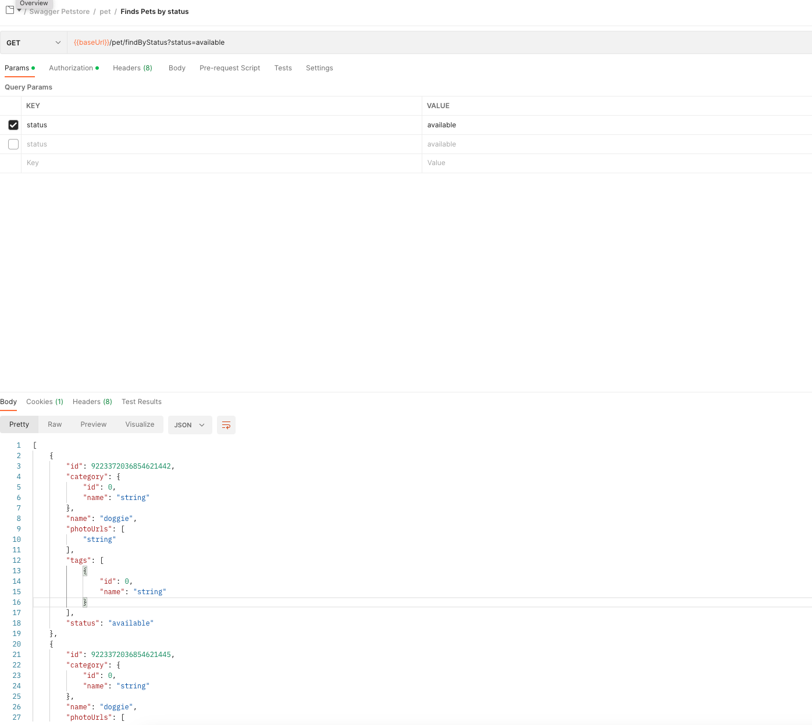

# Creating Rest Connectors 
    This article shows how to use and create custom rest connector in webMethods.io Integration.

# Usecase
When you are integarting with a Rest application with multiple resources, instead of using http invokes/calls in your workflow or FlowService, its better to create a rest connector and use it. Which will help you to define common **Error response/handling**, common **Authentication handling**, **sharable/reusable structures/document types** etc.

As an example we will use the open petstore swagger https://petstore.swagger.io/ as our rest application to showcase this usecase. 

# Topics
1. Creating custom rest connector 
2. Creating reources 
3. Creating account
4. Creating operations

# Steps

## webmethods.IO
### Creating custom rest connector
1. Create / Open your project in IO tenant 

2. Navigate to Connectors > Rest and click on **Add Connector**. provide name, URL(https://petstore.swagger.io/) and select **Credentials** as Authentication Type and save
   

### Creating reource & operations
1. Click **Add Resource** with name (example:findPetsByStatus) and path as shown below
   

2. Click and select the respective method (GET).
3. Add Parameters **status** as , Header **Content-Type** and **Accept** with value **application/json**
   

4. Add request body if needed.

5. Add response body for HTTP range **200-299**, to create a document type you could execute the resource in postman and copy the result json.
   

6. Add another response body for HTTP range **400-599** for Error. Even for Error you could create a common document type. Also please sure to select "Error Response".
   

### Creating account
1. Navigate to Connectors, Hover over the created connector and click on **Add Account**. Select **Authorization Type** as **Basic** (just example) and rest could be left default.

### Creating Opeartions
1. Navigate to Connectors, hover over the created connector and click **Operations**
   

2. Click **Add Operation**, provide a name (example: findBytStatus), select the created account and save it.
   

# Downloads / Assets

You could find the export of Workflow using, along with Connector definitions in **assets/workflow**.

## How to use/test

1. Login to wM.IO tenant
2. Navigate to project where you want to import
3. Import the zip from assets/workflow
4. Add an account with name "Oauth_None" and details as provided in markdown
